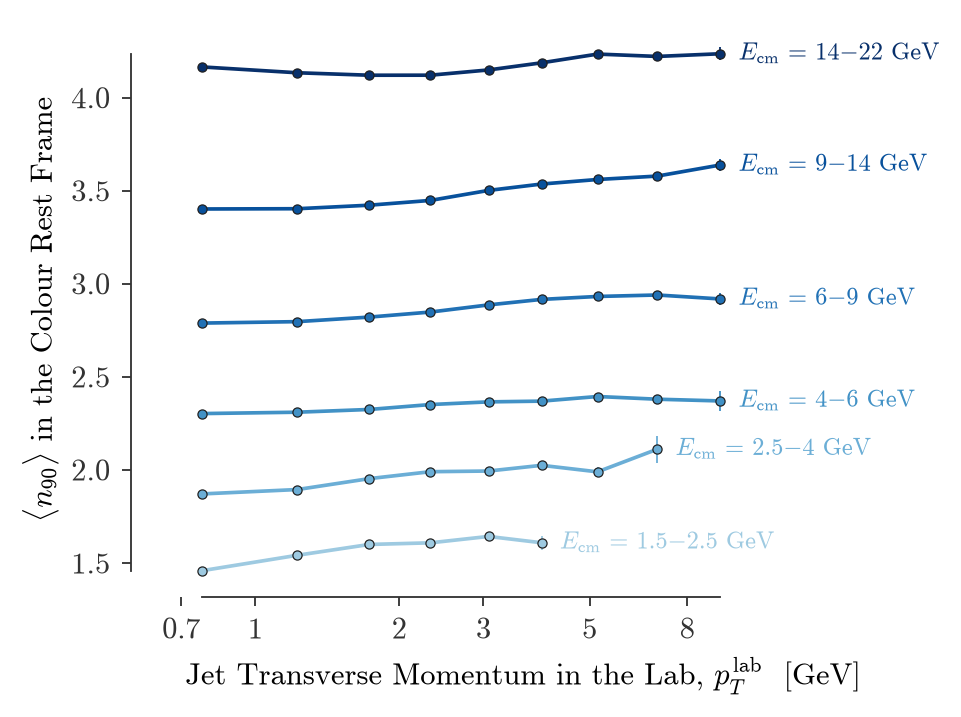
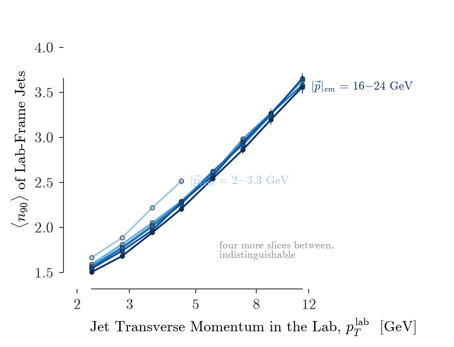

# EICFFS — EIC Frame-dependent Fragmentation Shift Study

A self-contained Docker framework for studying the **Frame-dependent Fragmentation
Shift (FFS) effect** at the Electron–Ion Collider (EIC), based on the paper:

**Reference:** [arXiv:2308.10951](https://arxiv.org/abs/2308.10951)  
*Phys.Lett.B 866, 2025, 139561 — Lee et al., University of Tennessee Knoxville*

---

## Physics Overview

### The FFS Effect

In QCD, jet fragmentation occurs in the **colour rest frame** — the rest frame
of all colour-connected particles — not the lab frame.  When a jet has fixed
lab-frame momentum |p|_lab, the boost between the lab frame and the colour rest
frame depends on the event kinematics.  As a result, two jets with the *same*
lab-frame momentum can have very different internal structure if they come from
different kinematic configurations (different colour rest frames).

This **Frame-dependent Fragmentation Shift (FFS)** is illustrated in
arXiv:2308.10951 using e⁺e⁻ → 3j (colour rest frame = lab frame) vs.
e⁺e⁻ → ZZ → 4j (colour rest frame = boosted Z rest frame).  For the ZZ
process, ⟨n₉₀⟩ is set by m_Z/2 ≈ 45 GeV *regardless* of the lab-frame
momentum, leading to 50% differences from the 3j case at high momentum.

### Primary observable: n₉₀

Following arXiv:2308.10951 Sec. 2, the main observable is **n_x** — the
fractional minimum number of jet constituents (ordered by decreasing 3-momentum
magnitude) needed to recover *x*% of the total jet momentum:

1. Sort constituents by decreasing |p|  
2. Compute cumulative momentum fraction  
3. Interpolate to find fractional n needed to reach the threshold  

We use **n₉₀** (threshold = 90%), which is IRC-safe under momentum ordering
and strongly discriminates between jet populations from different colour topologies.
The simple charged-particle count N_charged is also stored as a secondary observable.

### The EIC analogy

In NC-DIS (*ep → eX*) the whole hadronic final state is one colour-connected
system with four-momentum *P + q* and invariant mass *W*.  Its rest frame, the
**photon–proton (γ\*p) centre-of-mass frame**, is therefore the colour rest
frame of the paper.  It is *not* the Breit frame: the two differ by a boost
along the boson axis (the struck quark carries *W*/2 in the γ\*p frame and
*Q*/2 in the Breit frame).  The Breit frame is used here only to select the
current hemisphere.  The DIS invariants:

| Symbol | Definition | Meaning |
|--------|-----------|---------|
| Q²   | −q²       | Photon virtuality |
| *x*   | Q²/(2P·q) | Bjorken-x (struck parton momentum fraction) |
| *y*   | P·q / P·k | Inelasticity |
| *W*   | √((P+q)²) | Photon-proton CM energy = colour rest frame energy |

The γ\*p frame moves along the beam axis with a rapidity *y*_cm that
*decreases* with *W* (from ≈3 at *W* = 10 GeV to ≈1.3 at *W* = 55 GeV for
10 × 100 GeV beams).  For **fixed lab-frame jet |p|**, a jet from a higher-*W*
event is therefore harder in its colour rest frame and fragments into more
particles: ⟨n₉₀⟩ rises with *W* at fixed |p|_lab.  This is the FFS effect at
the EIC.  The corrected simulation finds shifts of +35 % to +80 % between
*W* = 10–15 GeV and *W* = 32–45 GeV for |p|_lab = 2–22 GeV; see
[`PHYSICS_AUDIT.md`](PHYSICS_AUDIT.md) for the study note: the beam-energy
frame-independence test, the numbers, the audit of the original code and the
literature check (no prior EIC proposal of this kind was found).

---

## Repository Structure

```
EICFFS/
├── Dockerfile               # Container image definition
├── docker-compose.yml       # Multi-service orchestration
├── environment.yml          # Conda/mamba environment spec
├── run.sh                   # End-to-end pipeline script
│
├── PHYSICS_AUDIT.md         # Study note: beam-energy frame test, results, audit, prior work
│
├── generate_events.py       # Step 1 — Pythia8 NC-DIS event generation
├── analyze_events.py        # Step 2 — jets, frame boosts, n₉₀ → ROOT trees + histograms
├── make_figures.py          # Step 3 — Tufte-style figures (one panel per PDF)
├── irc_safety_test.py       # IRC safety of n₉₀ against soft-drop multiplicity
├── object_choice_test.py    # which current-region definition and thresholds to use
├── sd_frame_test.py         # which frame and variables for soft-drop multiplicity
├── make_plots.py            # Legacy multi-panel plots from the histograms
│
├── utils/
│   ├── __init__.py
│   ├── dis_kinematics.py    # 4-vector math, DIS invariants, frame boosts (vectorised)
│   └── tufte.mplstyle       # matplotlib style used by make_figures.py
│
├── figures/                 # Committed figures from the 2.4 M-event reference run
├── data/                    # Generated events & analysis file (gitignored)
└── plots/                   # Legacy plot output (gitignored)
```

---

## Quick Start (Docker — recommended)

### Prerequisites
- [Docker](https://docs.docker.com/get-docker/) ≥ 24
- [Docker Compose](https://docs.docker.com/compose/) ≥ 2

### Full pipeline (generate → analyse → plot)

```bash
# Build the image (first time, ~5–10 min for package installation)
docker compose build

# Run the complete pipeline (creates data/ and plots/ on the host)
docker compose run eicffs

# Or run steps individually:
docker compose run generate   # one seed, 300k events with W > 10 GeV → data/events_1.parquet
docker compose run analyze    # jets + frames + n90 → data/analysis.root
docker compose run plot       # figures → figures/*.pdf
```

### Customise via environment variables

```bash
N_EVENTS=50000 N_SEEDS=1 ./run.sh        # quick test
N_SEEDS=8 N_PARALLEL=4 WMIN=10 ./run.sh   # the reference run (≈5 min on 4 cores)
```

---

## Quick Start (local Python environment)

### Install (conda/mamba recommended)

```bash
mamba env create -f environment.yml
conda activate eicffs
```

### Run

```bash
# Full pipeline
./run.sh

# Step by step
python generate_events.py --n-events 300000 --seed 1 --Wmin 10 --output data/events_1.parquet --quiet
python analyze_events.py  "data/events_*.parquet" --output data/analysis.root
python make_figures.py    data/analysis.root --events data/events_1.parquet --outdir figures/

# beam-energy test: generate 5x41 and 18x275 samples the same way, analyse each, then
python make_figures.py data/analysis.root --outdir figures/ \
    --beams 5x41=data/analysis_e5p41.root 18x275=data/analysis_e18p275.root
```

`pip install pythia8mc fastjet uproot awkward hist vector matplotlib scipy pyarrow`
is enough without conda; the generator imports `pythia8` or `pythia8mc`.

---

## Scripts

### `generate_events.py`

Generates NC-DIS events at EIC kinematics using **Pythia8** and saves
particle-level data (all final-state hadrons and photons per event, the
scattered lepton and its QED radiation removed) together with the exchanged
boson *q*, the scattered lepton, the beam proton and the struck parton
four-vectors to an **Apache Parquet** file via `awkward-array`.  Lepton-beam
ISR is off and the DIS dipole-recoil shower is on; see `PHYSICS_AUDIT.md`.

Key options:

| Flag | Default | Description |
|------|---------|-------------|
| `--n-events` | 200 000 | Events to save |
| `--electron-energy` | 10 GeV | Electron beam energy |
| `--proton-energy` | 100 GeV | Proton beam energy |
| `--Q2min` / `--Q2max` | 1 / 1000 GeV² | Phase-space cuts |
| `--Wmin` | 0 | Keep only events with *W* above this (GeV) |
| `--seed` | 42 | Pythia8 random seed |
| `--output` | `data/events.parquet` | Output path |
| `--lepton-isr` | off | Re-enable lepton-beam ISR |
| `--quiet` | off | Suppress Pythia8 output |

### `analyze_events.py`

Reads one or more Parquet event files, finds anti-*k*_T **R = 0.4** jets in
the lab with **FastJet** (`--no-fastjet` for a cone fallback), boosts each jet
into the γ\*p and Breit frames, and writes a per-jet TTree `jets` (W, Q², x, y,
|p|_lab, p_T, η, |p|_cm, Breit-frame p_z, current-hemisphere flag, N_const,
N_charged, n₉₀ in the lab, n₉₀ from the same constituents in the γ\*p frame,
charged-only n₉₀, leading-constituent z, ΔR to the struck parton) plus a
per-event TTree `events`, a TTree `cmjets` of jets clustered *in the colour
rest frame* with an angular (e⁺e⁻) anti-*k*_T algorithm (`--cm-radius`), and
the following histograms (current jets only):

| Histogram | Axes | Observable |
|-----------|------|-----------|
| `n90_3d` | W × \|p\|_lab × n₉₀ | **Primary FFS 3D histogram** |
| `sum_n90_vs_W`, `count_n90_vs_W` | W × \|p\|_lab | ⟨n₉₀⟩ profile (sum + count) |
| `mult_3d` | W × \|p\|_lab × N_charged | Secondary FFS histogram |
| `sum_N_vs_W`, `count_vs_W` | W × \|p\|_lab | ⟨N_charged⟩ profile (sum + count) |
| `Q2`, `x`, `y`, `W` | 1D | DIS kinematic distributions |
| `Q2_vs_W` | W × Q² | Kinematic plane |
| `jet_eta_pt` | η × pT | Jet landscape |
| `n_jets` | N_jets | Jet multiplicity per event |

### `make_figures.py`

Reads the `jets` tree and draws one figure per PDF (PNG previews alongside),
following Tufte: range frames, direct labels, no grids or legends.

| File | Content |
|------|---------|
| `flat_cmjets.pdf` | **Primary result**: ⟨n₉₀⟩ of colour-frame jets vs *p*_T^lab, sliced in *E*_cm — flat |
| `flat_labjets.pdf` | the same test for lab jets — the slices collapse and rise, spanning 85 % |
| `universal_cm.pdf` | ⟨n₉₀⟩ vs *E*_cm sliced in *p*_T^lab — one curve |
| `sd_frame_choice.pdf` | soft-drop frame conventions on the beam test (from `sd_frame_test.py`) |
| `object_choice.pdf` | frame test over current-region definitions and particle thresholds (from `object_choice_test.py`) |
| `irc_safety.pdf` | collinear and soft safety of n₉₀ against n_SD (from `irc_safety_test.py`) |
| `beam_energy_sd.pdf` | n_SD across beam configurations, computed in the lab and in the colour frame |
| `frame_ladder.pdf` | **headline**: lab-frame dependence of each definition, for n₉₀ and standard-form n_SD, across three beam configurations |
| `frame_breakers.pdf` | the choices that introduce lab-frame dependence, ranked by how much |
| `ladder_vs_radius.pdf` | the lab-cone rung against anti-kT radius; *R* ≈ 1 is already frame independent |
| `beam_energy_sd_ee.pdf`, `beam_energy_sd_standard.pdf` | hemisphere n_SD across beam configurations in the e⁺e⁻ form (collapses) and the standard pp form (flat), same vertical span (from `sd_frame_test.py`) |
| `beam_energy_ordering.pdf` | the same hemispheres ordered by lab and by colour-frame momenta |
| `beam_energy_hemisphere.pdf`, `beam_energy_cmjet.pdf`, `beam_energy_labjet.pdf` | fixed (*W*, *Q*) cells across 5×41, 10×100 and 18×275 GeV: same physics, three lab frames, for the hemisphere, the γ*p-frame jet and the *R* = 1.2 lab jet (needs `--beams`) |
| `beam_energy_labjet_sd.pdf` | the *R* = 1.2 lab-jet panel for standard-form n_SD: IRC safe, lab momenta, flat |
| `hemisphere_vs_p.pdf`, `hemisphere_vs_p_fixed_q.pdf` | whole current hemisphere against full lab momentum, inclusive and sliced in *E*_cm, then at fixed *Q* |
| `hemisphere_p_vs_q.pdf` | at fixed *W* the current system's lab momentum is a function of *Q*: no independent boost knob |
| `slope_vs_radius.pdf` | residual lab-p_T dependence at fixed *Q* and *E*_cm against jet radius |
| `fixed_q_R04.pdf`, `fixed_q_hemisphere.pdf` | at fixed *Q*: an *R* = 0.4 cone stays sloped, the whole hemisphere goes flat |
| `capture_fraction.pdf` | fraction of the current system a lab cone holds, against lab *p*_T |
| `pt_fan.pdf` | lab jets vs *p*_T^lab sliced in *W* — the fan nearly closes |
| `ffs_fan.pdf` | ⟨n₉₀⟩ vs \|p\|_lab: ⟨n₉₀⟩ vs \|p\|_lab, one line per *W* slice |
| `ffs_boost_factor.pdf` | ⟨n₉₀⟩ vs \|p\|_lab / \|p\|_cm: the same colour-frame jet under different boosts |
| `ffs_collapse.pdf` | ⟨n₉₀⟩ vs \|p\|_cm on the fan's scale: the *W* slices agree and are nearly flat |
| `ffs_ratio.pdf` | ⟨n₉₀⟩ relative to the *W* = 10–15 GeV slice — size of the shift |
| `ffs_slopegraph.pdf` | low-*W* → high-*W* shift per \|p\|_lab bin, with percentages |
| `ffs_distribution.pdf` | n₉₀ quantile bands vs *W* at \|p\|_lab = 4.5–10 GeV |
| `ffs_wq_table.pdf` | ⟨n₉₀⟩ over the (*W*, *Q*) plane: colour-frame energy vs hard scale |
| `nch_fan.pdf`, `ncon_boost_factor.pdf` | the same for N_charged and N_constituents |
| `boost_map.pdf` | rapidity of the colour rest frame across (x, Q²), iso-*W* lines, the jets |
| `plateau.pdf` | charged-hadron rapidity plateau in the γ\*p frame per *W* slice |




### `make_plots.py` (legacy)

The original multi-panel figures from the histograms (`./run.sh --legacy-plots`).

------|---------|
| `ffs_main.pdf` | **Primary result**: ⟨n₉₀⟩ vs *W* for each \|p\|_lab bin |
| `ffs_ratio.pdf` | ⟨n₉₀⟩ ratio to lowest-|p|_lab bin — FFS magnitude |
| `kinematics.pdf` | DIS kinematic plane (Q² vs W) + marginal distributions |
| `jet_landscape.pdf` | Jet η–pT heat-map + jet multiplicity per event |
| `ffs_heatmap.pdf` | 2D colour map of ⟨n₉₀⟩(*W*, \|p\|_lab) |

---

## Software Stack

| Package | Role |
|---------|------|
| [Pythia8](https://pythia.org) | Hard-process MC event generation (`pythia8` or `pythia8mc`) |
| [FastJet](https://fastjet.fr) | Anti-*k*_T jet finding (R=0.4), awkward interface |
| [vector](https://vector.readthedocs.io) | Lorentz-vector behaviours for awkward arrays |
| [uproot](https://uproot.readthedocs.io) | ROOT I/O (no ROOT dependency) |
| [awkward-array](https://awkward-array.org) | Ragged array handling |
| [hist](https://hist.readthedocs.io) | Histogram filling & manipulation |
| [matplotlib](https://matplotlib.org) | Plotting |
| [mplhep](https://mplhep.readthedocs.io) | HEP plot styling |
| [scipy](https://scipy.org) | Gaussian smoothing for heat maps |

